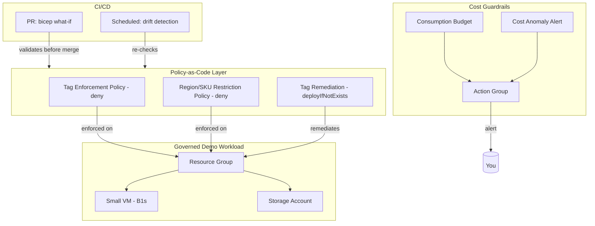

# Architecture

## Overview

This platform enforces cost and governance guardrails on Azure through
policy-as-code, then proves those guardrails work using real cost data
scoped to the same tags the policy enforces.

## Diagram

## Trust/control boundaries

- **Policy scope**: subscription-level, so no resource group can opt out
  of tag enforcement or region/SKU restriction.
- **Budget scope**: subscription-level, tracking total spend against the
  ~$150/month constraint.
- **Remediation scope**: targets the demo resource group only, to avoid
  unintended changes outside this project's footprint.

## Why subscription-level policy, not resource-group-level

Scoping policy to the resource group would prove the policy *can* work,
but not that it *governs* — a resource group-scoped policy can be
bypassed by simply creating resources elsewhere in the subscription.
Subscription-level scope is what an actual enterprise landing zone does,
and it is what makes the "deny" test meaningful: attempting to create an
untagged resource anywhere in the subscription should fail.

## Lessons learned

(Filled in as the project progresses — kept deliberately honest about
what broke and what I'd do differently.)

## Lessons learned

This section documents real issues encountered during the build, not
a sanitized retrospective — each one changed a design or implementation
decision.

- **Azure Policy `mode: Indexed` silently excludes resource groups and
  subscriptions from evaluation.** Both the tag-enforcement policy and
  the tag-remediation policy were built with `mode: Indexed` first, and
  both silently failed to evaluate resource-group-level resources as a
  result — no error, just resources that should have been caught
  slipping through undetected. Switching to `mode: All` fixed both.
  This is now the default assumption for any future policy in this
  project: use `All` unless there's a specific reason to scope narrower.

- **Azure Policy deny effects compound across scopes.** This
  subscription already had pre-existing management-group-level policies
  (`Require Owner tag`, `Require CostCenter tag`) before this project's
  own policy was deployed. The first attempt to prove the deny policy
  worked was actually blocked by the pre-existing org policy, not the
  one built here — isolating the test required creating a resource that
  satisfied the org's requirements but deliberately failed only this
  project's additional `Environment` tag requirement.

- **Git Bash on Windows silently mangles `/subscriptions/...` style
  arguments** via MSYS path conversion, rewriting them into Windows
  paths (e.g. prefixing `C:/Program Files/Git/`) without any error —
  the command still runs, just against a broken value. This caused a
  budget's action group reference to silently deploy incorrectly on
  the first attempt. Fix: prefix the affected command with
  `MSYS_NO_PATHCONV=1`.

- **Long heredocs in Git Bash occasionally truncate or corrupt on
  paste**, particularly multi-resource Bicep files. This happened
  several times across this project and wasted real debugging time
  before the pattern was recognized. The fix that worked reliably:
  write files in small, verified increments (checking line
count with
  `wc -l` after each append) rather than one large paste.

- **Not all Azure resource types are indexed by Azure Resource Graph.**
  `Microsoft.Consumption/budgets` returns zero results from
  `Resources | where type == 'microsoft.consumption/budgets'` even
  though the budget genuinely exists and is visible in the portal.
  The Phase 7 dashboard's budget panel was redesigned around the
  action group resource instead, which is properly indexed.

- **`az vm delete` does not cascade-delete the VM's managed OS disk**
  by default. After the Phase 4 workload teardown, the disk resource
  remained and had to be deleted separately — a realistic, easy-to-miss
  cost leak if not checked for explicitly.

- **This tenant restricts App Registration creation** to Global/
  Application Administrators (`Users can register applications: No`),
  which blocked both Service Principal and OIDC-based GitHub Actions
  authentication. Rather than requesting elevated tenant permissions
  for a portfolio project, Phase 6's CI/CD scope was reduced to
  authentication-free Bicep compilation checks — see ADR 0003.

- **New Azure resource types (like `Microsoft.CostManagement/
  scheduledActions`) can have API version quirks even for basic
  operations like deletion** — the CLI's auto-selected API version
  didn't support delete, requiring an explicit `--api-version` pin
  matching the version used at creation time.
