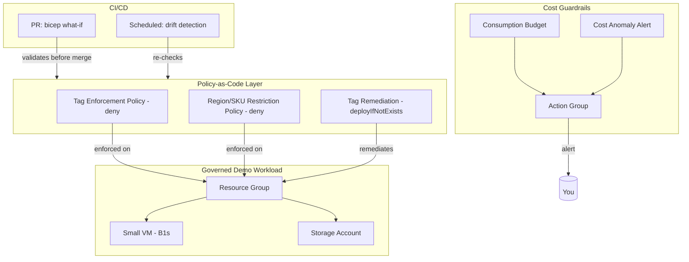

# Architecture

## Overview

This platform enforces cost and governance guardrails on Azure through
policy-as-code, then proves those guardrails work using real cost data
scoped to the same tags the policy enforces.

## Diagram

## Trust/control boundaries

- **Policy scope**: subscription-level, so no resource group can opt out
  of tag enforcement or region/SKU restriction.
- **Budget scope**: subscription-level, tracking total spend against the
  ~$150/month constraint.
- **Remediation scope**: targets the demo resource group only, to avoid
  unintended changes outside this project's footprint.

## Why subscription-level policy, not resource-group-level

Scoping policy to the resource group would prove the policy *can* work,
but not that it *governs* — a resource group-scoped policy can be
bypassed by simply creating resources elsewhere in the subscription.
Subscription-level scope is what an actual enterprise landing zone does,
and it is what makes the "deny" test meaningful: attempting to create an
untagged resource anywhere in the subscription should fail.

## Lessons learned

(Filled in as the project progresses — kept deliberately honest about
what broke and what I'd do differently.)
